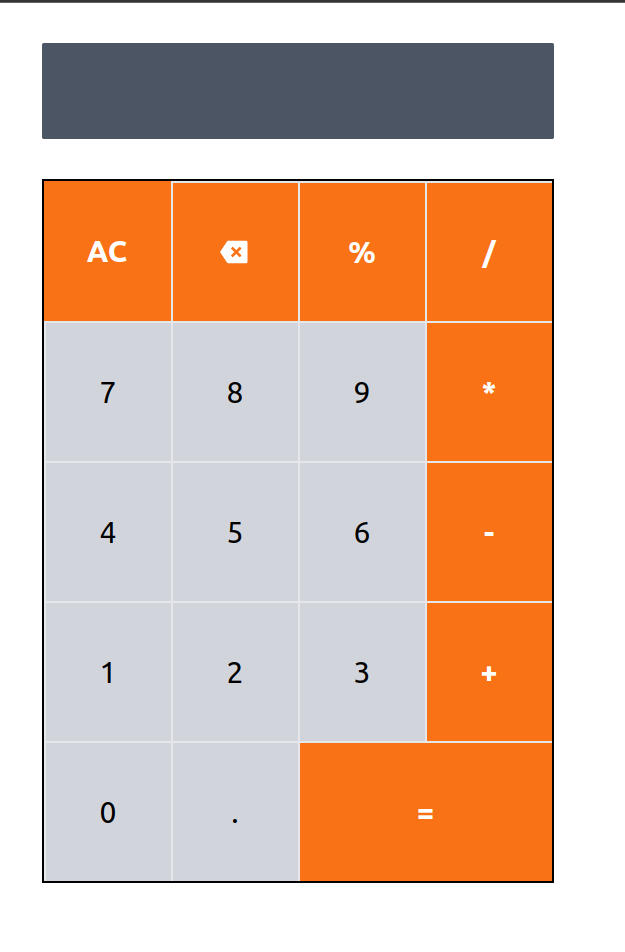

# Basic calculator app

A basic calculator that uses reverse polish notation for evaluation the arthmetic operation.

## Technologies

- React.js
- magic-regexp
- react-icons

## Author

Jonathan Z.

- [Twitter](https://twitter.com/JonathanZihind4)
- [LinkedIn](https://www.linkedin.com/in/jonathan-z-0a40ab209/)
